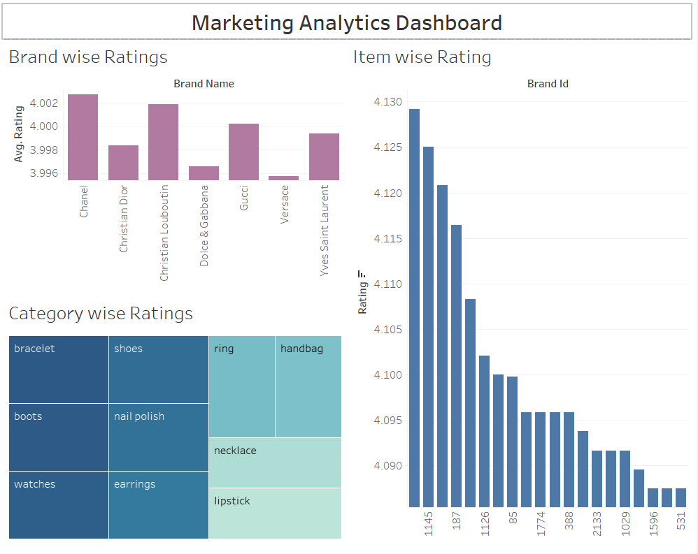
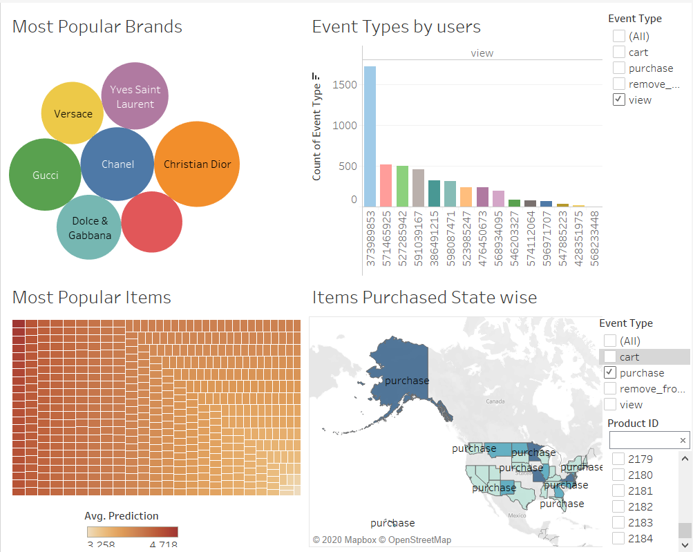

**FINAL PROJECT** 
*SENORITA STORE* 
Senorita's E-commerce department who have a large customer base using different recommendation systems to provide suggestions to the customers.They want to build search and recommendation engines along with analytical dashboards 
To illustrate the value of data-driven analytics to derive meaningful insights, to ease customer shopping experience, and to make recommendations for users. For marketers and company-heads to understand patterns of sales and ways to target the customers and analyze sales.This project will help Business Analyst, and Business Strategist to make business decisions which will help Senorita maximize its sales. Also to enhance the customer's shopping experience.

**Project Proposal** 

**Report** 

Claat Link: https://codelabs-preview.appspot.com/?file_id=184qVt5hNiCfuIXLvmdgEHqjW3zn2LsPVIS6TX7nfcB4#1  
Google Docs: https://docs.google.com/document/d/1GVj5-7aUGGp22Bq0jwXt-D7qibAYwDBuZ45fRTGxCRA/edit#heading=h.mmt3dpnuogwo  
**Analytics Dashboard** 
 
 

**Recommendation Models** 
A recommender system predicts the rating value of a user-item combination with an assumption that the training data available indicates a user’s preference for other items.
We use the user-item Interaction Data, such as ratings and apply various modelling techniques that uses collaborative filtering to predict user’s preference. 
We have executed 2 Recommendation models 
1. SVD- Surprise Singular Value Decomposition 
2. NCF 
We have computed the evaluation metrics of both these models 
Based on the predicted ratings we recommended popular items to a particular user. 

**Similarity Search Model**
Users can find the products they are looking for using the Search feature 
The search feature also lists the products similar to the items being searched 

  
  Website Navigation 
  1.Home Page 
   Login 
    SVD Model 
    Ncf Model 
  
  
  2.Search Page 
   Search for items to show similar Images: 
  
  
  
